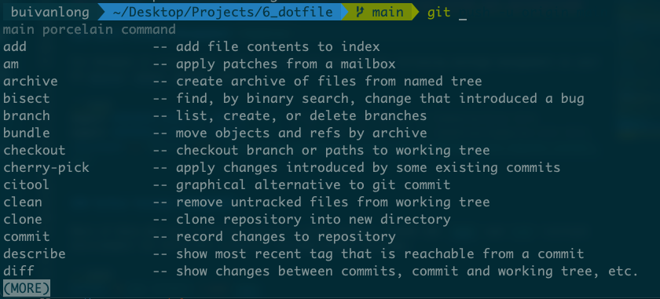

# How to set up Development Environment as DataDev

    Known as Data Tech-Stack for building OpenData platforms and applications.

    Try to use this setup for your projects, doing custom configuration as your application requires.

## Contents

- [General Settings](#general-settings)
- [Data Applications](#data-applications)
- [Data Platforms](#data-platforms)
- [Development](#development)
- [Project Structure](#project-structure)

## General Settings

*As Developer, spending a lot of time to mimic from internet and custom your personalized*



### MacOS Package Management `homebrew`

For Windows or Linux users, you will need to install the following package management as your OS distro: choco, pacman, apt,...

```bash
export HOMEBREW_BREW_GIT_REMOTE="..."  # put your Git mirror of Homebrew/brew here
export HOMEBREW_CORE_GIT_REMOTE="..."  # put your Git mirror of Homebrew/homebrew-core here
/bin/bash -c "$(curl -fsSL https://raw.githubusercontent.com/Homebrew/install/master/install.sh)"
```

### Python Package Management

Most of Data Dev are installed and built using Python. PLEASE USE `VENV` and `pip` (virtual environment for different projects) instead global settings.

```bash
python -m pip install --user venv
python -m venv --help

# cd to working directory, and install requirements.txt
cat requirements.txt # Show list of libraries
# Flask
# pymongo
# flask_cors
# kafka-python
# pandas
# pyarrow
# boto3
# snowflake-connector-python

pip install -r requirements.txt
```

### Terminal

Using --Oh my zsh!!-- , build comfortable Terminal Settings because you might work a lot with CLI.

```bash
sh -c "$(curl -fsSL https://raw.githubusercontent.com/ohmyzsh/ohmyzsh/master/tools/install.sh)"
```

Change theme settings by:
> echo "ZSH_THEME="agnoster"" >> ~/.zshrc

Or, visit <https://github.com/ohmyzsh/ohmyzsh/wiki/Theme>

**Recommend to use iTerm2**

Easily install iTerm2 by this `brew install iTerm2`

#### Plugins

1. Install plugins

```bash
git clone https://github.com/zsh-users/zsh-autosuggestions.git $ZSH_CUSTOM/plugins/zsh-autosuggestions


git clone https://github.com/zsh-users/zsh-syntax-highlighting.git $ZSH_CUSTOM/plugins/zsh-syntax-highlighting

git clone https://github.com/zdharma-continuum/fast-syntax-highlighting.git ${ZSH_CUSTOM:-$HOME/.oh-my-zsh/custom}/plugins/fast-syntax-highlighting

git clone --depth 1 -- https://github.com/marlonrichert/zsh-autocomplete.git $ZSH_CUSTOM/plugins/zsh-autocomplete
```

1. Change config

```bash
 plugins=(
  git
  zsh-autosuggestions
  zsh-syntax-highlighting
  fast-syntax-highlighting
  zsh-autocomplete
 )
```

3. Run `source ~/.zshrc`

### Browser

Lightweight, Secure, Private with [Min Browser](https://minbrowser.org/)

### KeyCastr

To display the keyboard on the screen

```bash
brew install keycastr --cask
```

### Container Setup for Development

Navigate to `./containers/` and run `docker-compose up`


*Don't kill a machine*

## Data Applications

*When you're joining a project for building Data SaaS*

### 1. Core Backend

- Flask [Flask](https://flask.palletsprojects.com/en/3.0.x/)
- Structured Data & Simplified Data warehouse [PostgreSQL](https://www.postgresql.org/)
- Data Programming [Python3.9.0](https://www.python.org)

### 2. Frontend

- [Node.js 16](https://nodejs.org/en/) or upper
- [JavaScript](https://www.typescriptlang.org/)
- Web Framework/Library: [React](https://reactjs.org/)

### 3. Additional Tools

- DataOps: [Dbt](https://www.getdbt.com/)
- CI/CD: [GitHub Actions](https://github.com/features/actions)
- Containerization: [Docker](https://www.docker.com/) and [Docker Compose](https://docs.docker.com/compose/)

## Data Platforms

*When you're joining a project for building Data PaaS*

### 1. Storage

- File object storage - Datalake (using for partition): [MinIO](https://min.io/)
- Non-Structured Data: [MongoDB](https://www.mongodb.com/)

### 2. Processing

- Streaming and Batching: [Flink](https://www.flink.apache.org)
- Big Data Processing: [Spark](https://spark.apache.org/) or [Arrow](https://arrow.apache.org/docs/index.html)

### 3. Warehousing

Free Register and do mockup, install CLI

- [Databricks](https://www.databricks.com/)
- [Snowflake](https://www.snowflake.com/)

### 4. Programming

- Programming OOP & Functions [Scala](https://scala-lang.org/)
- Backend & Infra [Go](https://go.dev/)
- Fundamentals Data Engineering and Software Development

### 5. Protocol

- Sync [Rest API](https://restfulapi.net/)
- ASync [Message Queue](https://kafka.apache.org/)

### 6. Semantic

- Modeling [Power BI](https://powerbi.microsoft.com/en-us/) or SuperSet

### 7. Cloud Providers

Any of cloud providers [AWS] , Azure, GCP

### 8. Infrastructure

- Infrastructure as Code [Terraform](https://www.terraform.io/)
- Monitoring [Grafana](https://grafana.com/)
- Logging [Prometheus](https://prometheus.io/docs/introduction/overview/) or [ELK](https://www.elastic.co/elastic-stack/) Stack

## Development

Supporting Development Tools

- VSCode [VSCode](https://code.visualstudio.com/)
- Dbeaver [Dbeaver](https://dbeaver.com/docs/dbeaver/)
- Postman [Postman](https://www.postman.com/)
- MongoDBCompass [MongDb](https://www.mongodb.com/products/tools/compass)
- CLI
- [OrbStack](https://orbstack.dev/) (Only for Mac users)
- Debugging, Breakpoints, logging
- Tree Viewer [$ brew install tree]


## Project Structure

```bash
.
├── LICENSE
├── README.md : information about the project
├── app : contains data application
├── devops : contains cicd, infrastructure
├── docs : documentation
├── docusaurus : docs generator
├── run-stringx-platform.sh : master script to run the project
├── servers : contains data servers
└── venv-stringx : py virtual environment
```

----------------------------------------------------------------
*I created this setting for my development setup, for contribution please create PR and update your preference*
